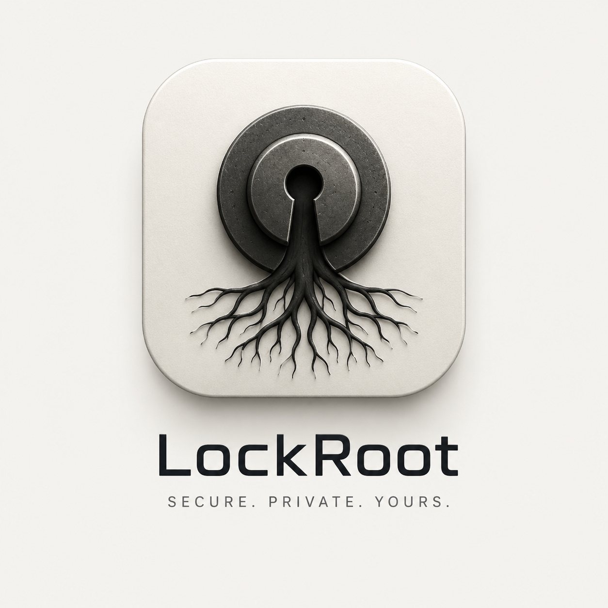

# Lockroot

<p align="center">
  
</p>

<p align="center">
  <strong>Encryption does not save a master password like <code>password123</code>.</strong><br>
  <em>Lockroot can protect the vault properly, but it cannot make a weak password brave.</em>
</p>

Lockroot is a local password manager I built for Android, iOS, Windows, Linux, and macOS.

No account. No cloud sync. No analytics. No ads. No telemetry. No recovery backdoor.

The vault stays on the device. If you export it, the export is encrypted with a separate password. If the master password is lost, the vault is gone. That is intentional.

## Download

- iOS App Store: https://apps.apple.com/app/id6770449898
- Android: Google Play internal testing
- Windows: GitHub release installer
- Linux: GitHub release packages
- macOS: native SwiftUI build in this repo
- Website: https://lockroot.rothackers.com

## What Lockroot Does

- Creates an encrypted local vault.
- Unlocks with a master password.
- Stores titles, websites, usernames, passwords, notes, and tags inside encrypted data.
- Adds, edits, deletes, searches, reveals, and copies entries.
- Generates passwords with length and character group options.
- Clears copied secrets from the clipboard after a short delay.
- Locks when the app is backgrounded or inactive, depending on the platform.
- Exports encrypted backups with a separate export password.
- Imports encrypted backups with preview, merge, or replace.
- Requires Terms and Conditions before the first vault is created.

## Security Model

Lockroot never uses the password directly as an encryption key.

```text
Master password
  -> Argon2id
  -> 256-bit vault key
  -> authenticated encryption
  -> encrypted local vault
```

Exports use a different password and a different KDF salt:

```text
Export password
  -> Argon2id
  -> export key
  -> encrypted export file
```

Wrong password means authentication failure. Lockroot does not decrypt garbage and pretend it worked.

## Crypto

- KDF: `Argon2id`
- Android: Argon2id with Bouncy Castle, XChaCha20-Poly1305 with libsodium
- iOS: Argon2Swift, Swift-Sodium / libsodium, XChaCha20-Poly1305
- macOS: Argon2Swift, Swift-Sodium / libsodium, XChaCha20-Poly1305
- Windows: Bouncy Castle, AES-256-GCM
- Linux: Bouncy Castle, AES-256-GCM
- Vault metadata is authenticated as associated data.
- Every vault/export has a random salt.
- Every encryption gets a fresh nonce.
- The master password is never stored.
- The raw derived key is never written to disk.

Android still supports old AES-GCM vaults for migration, but new Android/iOS/macOS vaults use XChaCha20-Poly1305.

## Platform Notes

Android declares no permissions right now. No Internet, camera, contacts, location, microphone, notifications, or broad storage access. Import/export uses the system document picker.

iOS locks when the app leaves the foreground. Apple does not give iOS apps the same full screenshot blocking API Android has.

Windows ships as a normal installer, locks after inactivity/minimize, and asks Windows to exclude vault windows from normal screen capture where supported.

Linux is built with Avalonia and ships through GitHub release packages.

macOS is SwiftUI, sandboxed for App Store builds, and uses the same vault/export format as iOS.

## Linux Install

Download Linux builds from:

```text
https://github.com/regaan/LockRoot/releases
```

AppImage:

```bash
chmod +x Lockroot-linux-x64-1.2.0.AppImage
./Lockroot-linux-x64-1.2.0.AppImage
```

Debian / Ubuntu:

```bash
sudo apt install ./Lockroot-linux-x64-1.2.0.deb
lockroot
```

Fedora / RHEL / openSUSE style systems:

```bash
sudo dnf install ./Lockroot-linux-x64-1.2.0.rpm
lockroot
```

Portable tarball:

```bash
mkdir lockroot
tar -xzf Lockroot-linux-x64-1.2.0.tar.gz -C lockroot
cd lockroot
./Lockroot
```

Replace `1.2.0` with the latest release version if needed.

## Run From Source

### Android

Open the repo in Android Studio and run the `app` module.

Build from terminal:

```bash
./gradlew clean testReleaseUnitTest assembleRelease bundleRelease
```

### iOS

The iOS project is here:

```text
ios/Lockroot/Lockroot.xcodeproj
```

Open it in Xcode, resolve packages, select the `Lockroot` scheme, then run on a device or simulator.

### macOS

The macOS Xcode project is here:

```text
macos/Lockroot/Lockroot.xcodeproj
```

Open it in Xcode:

```bash
open macos/Lockroot/Lockroot.xcodeproj
```

Select the `Lockroot` scheme and run on `My Mac`.

There is also a Swift package version here:

```text
macos/LockrootMac/Package.swift
```

### Windows

Build the Windows app:

```powershell
dotnet restore .\windows\Lockroot.Windows\Lockroot.Windows.csproj --configfile .\windows\Lockroot.Windows\NuGet.Config -r win-x64
dotnet publish .\windows\Lockroot.Windows\Lockroot.Windows.csproj -c Release -r win-x64 --self-contained true
```

Build the installer:

```powershell
iscc .\windows\installer\lockroot.iss
```

Installer output:

```text
windows/installer/output/
```

### Linux

Build the Linux app:

```powershell
$env:DOTNET_CLI_HOME = (Resolve-Path .dotnet-cli).Path
$env:NUGET_PACKAGES = (Resolve-Path .nuget\packages).Path
$env:APPDATA = (Resolve-Path .appdata).Path
$env:LOCALAPPDATA = (Resolve-Path .localappdata).Path
dotnet build .\linux\Lockroot.Linux\Lockroot.Linux.csproj -c Release --configfile .\linux\Lockroot.Linux\NuGet.Config -p:UsedAvaloniaProducts=
dotnet publish .\linux\Lockroot.Linux\Lockroot.Linux.csproj -c Release -r linux-x64 --self-contained true --configfile .\linux\Lockroot.Linux\NuGet.Config -p:UsedAvaloniaProducts= -p:PublishSingleFile=false
```

## No Recovery

There is no forgot-password flow.

There is no recovery key.

There is no server backup.

If the master password is lost, Lockroot cannot decrypt the vault. Keep an encrypted export somewhere safe if the data matters.

## Real Limits

Lockroot protects vault data at rest. It does not make a compromised machine safe.

Things that can still beat any password manager:

- a rooted or compromised device
- malware with screen or memory access
- malicious keyboard/accessibility tools
- fake builds signed by someone else
- someone watching the master password
- a weak master password
- secrets already copied to another app

Use a trusted build and a real master password.

## Repository Layout

```text
app/src/main/java/com/regaan/lockroot/
  MainActivity.kt                 Android UI and app flow
  crypto/                         Argon2id and AEAD wrappers
  security/                       Clipboard clearing
  ui/                             Local illustrations
  vault/                          Vault models, file format, repository, storage

ios/Lockroot/
  Lockroot.xcodeproj              iOS Xcode project
  Lockroot/App/                   App entry and state model
  Lockroot/Crypto/                Argon2id and libsodium crypto service
  Lockroot/Vault/                 Vault codec, storage, repository
  Lockroot/UI/                    Setup, unlock, home, settings, sheets

macos/Lockroot/
  Lockroot.xcodeproj              macOS Xcode project
  Lockroot/Resources/             macOS app icon and bundled images

macos/LockrootMac/
  Package.swift                   Swift package version
  Sources/LockrootMac/            Shared macOS SwiftUI source

windows/Lockroot.Windows/
  Lockroot.Windows.csproj         Windows WPF project
  MainWindow.xaml                 Windows app UI
  Security/                       Argon2id and AES-256-GCM
  Vault/                          Repository, storage, codec
  Services/                       Settings, clipboard, generator
  Dialogs/                        Entry editor and prompts
  Assets/                         Windows visual assets

windows/installer/
  lockroot.iss                    Inno Setup script
  terms.txt                       Installer terms

linux/Lockroot.Linux/
  Lockroot.Linux.csproj           Linux Avalonia project
  MainWindow.cs                   Linux UI and app flow
  Security/                       Argon2id and AES-256-GCM
  Vault/                          Repository, storage, codec
  Services/                       Legal text, generator, strength rules
  Assets/                         Linux visual assets

linux/packaging/
  appimage/                       AppImage packaging
  deb/                            Debian package script
  rpm/                            RPM spec and script
  flatpak/                        Flatpak manifest

docs/assets/
  lockroot.png                    README logo
```

## License

Lockroot is licensed under the GNU Affero General Public License v3.0 or later.

SPDX:

```text
AGPL-3.0-or-later
```

## Creator

Built by Regaan.

Security Researcher, Offensive Engineer, and Full-Stack Developer from Chennai, India.

- Website: `rothackers.com`
- GitHub: `github.com/regaan`
- LinkedIn: `linkedin.com/in/regaan`
- Email: `regaan48@gmail.com`
